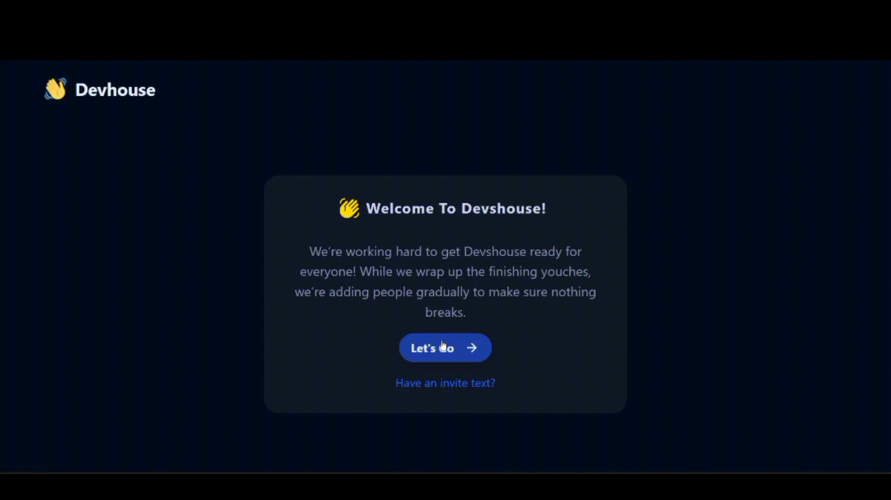
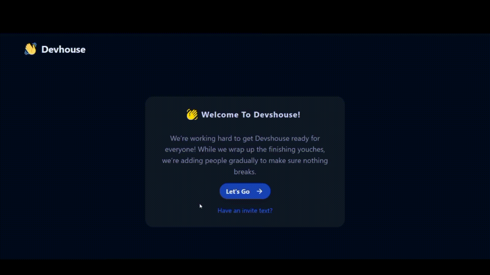

# Dev House

A social audio Web-App where users can communicate in audio chat rooms that accommodate groups of thousands of people and include features to create a club to host multiple events.

The Application is developed using ReactJS, NodeJS, Express, MongoDB, Socket.io, WebRTC.

## Authors

- [@chandansahoo](https://github.com/chandansahoo69)

## Features

- Dark Theme
- Live previews
- Responsive
- Cross platform

# Demo

### Register



### Login



### Rooms, Clubs, Account


## Run Locally

Clone the project

```bash
  git clone https://github.com/chandansahoo69/DevHouse
```

Go to the project directory

```bash
  cd DevHouse
```

Install dependencies

```bash
  yarn add
```

Start the server

```bash
  yarn start
```

## Tech Stack

**Client:** React, Redux, TailwindCSS, Web Sockets, Socket.io

**Server:** Node, Express, MongooDB
